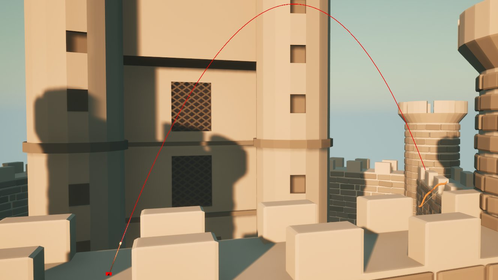
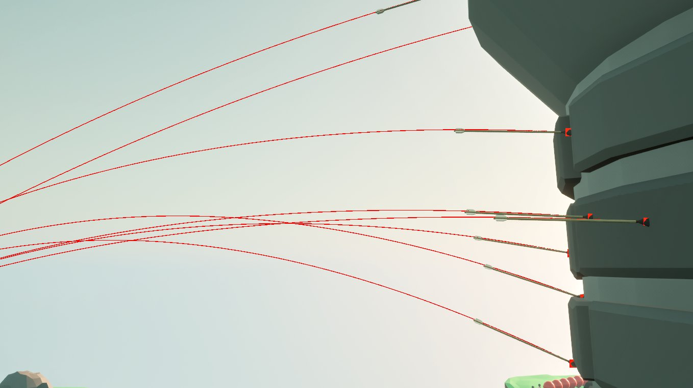
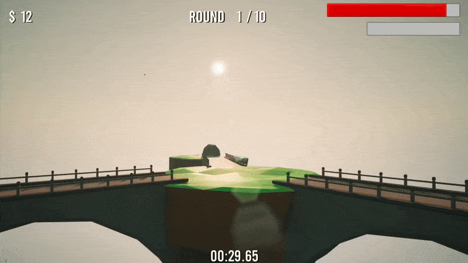
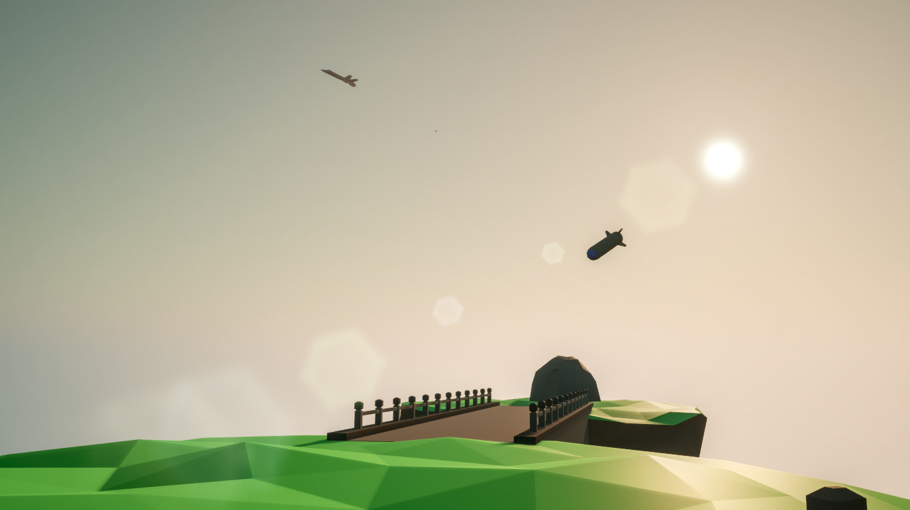
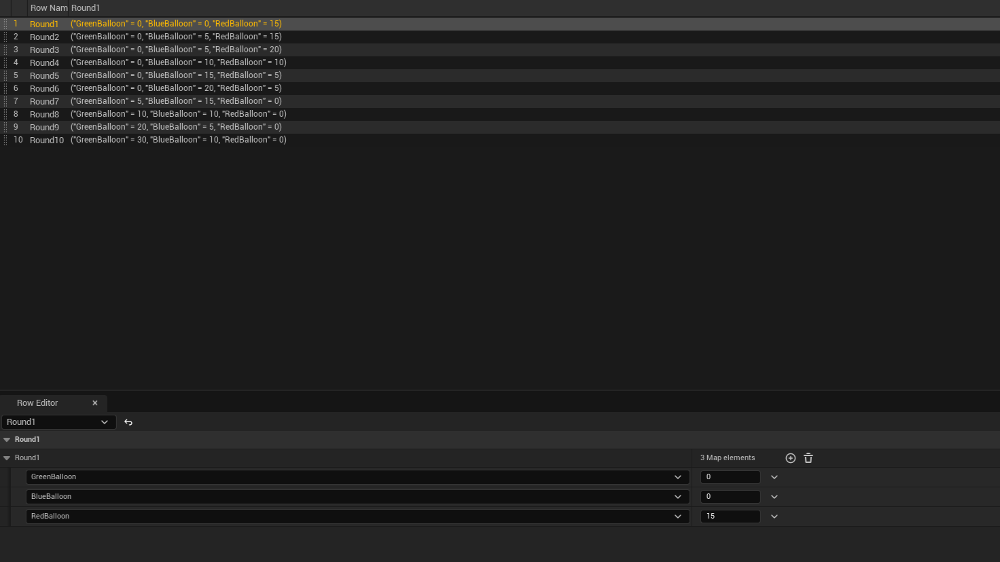
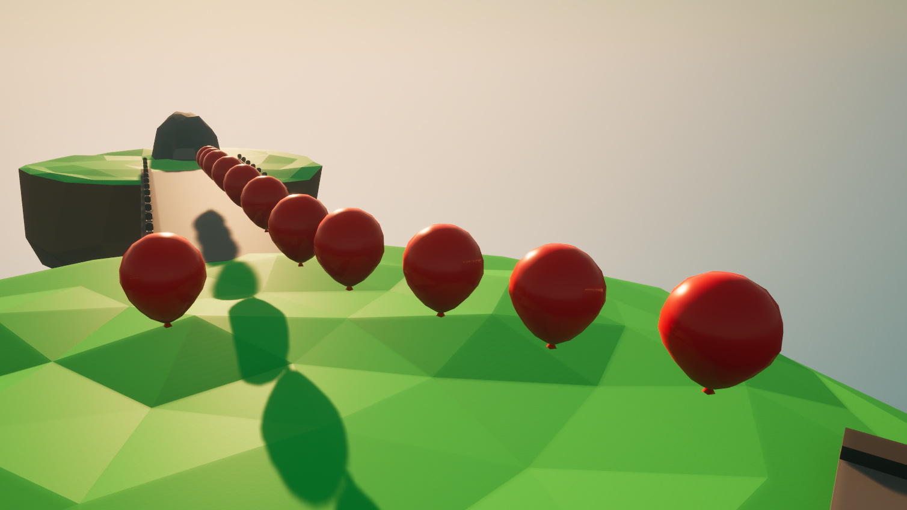

# Arrowhold

## Game Description
Arrowhold is a game where you defend a castle with your bow. You will be invaded by balloons, and for every balloon killed you will receive money. With the help of money, you can upgrade your bow or buy other things like a ground strike fighter jet. Your goal is to survive 10 rounds without taking too much damage and also manage your economy.

## My biggest achievements in this project
- Added arrow physics and precise collision detection  
- Missiles that can track targets  
- Level creation system  
- Animated the bow

With Arrowhold, the goal was to learn as much as possible about **Unreal Engine** during this project. Additionally, I created all the 3D models myself using **Blender**, and also all the VFX using **Unreal Engine's** Niagara system.

## Arrow collision and flight path
**One** of the more tricky parts of this game was to make sure the arrow felt right. The arrow's collision didn't work as expected when I tried to use **Unreal's** collision system, so I created an effective solution that compares the arrow's position between the last frame and the current frame to see if it hit anything. This method also allowed me to change how deep the arrow would penetrate objects.

To get the arrow's flight path to feel right, I adjusted the drag and weight of the arrow and rotated it to match its velocity vector, which worked well.

  
  

## Missile tracking
In the game, players can purchase a strike aircraft that launches guided missiles at a designated target. Once fired, the missiles can track and steer toward the selected target, exploding on impact and generating an AOE explosion.

To make the missile behave a little bit more realistic, each missile begins with limited steering capability. After a short delay the missile gains more speed and it's manoeuvrability increases, allowing it to make bigger adjustments.

  
  

## Level creating system
To be able to quickly create levels in the game I needed a system where I could input what type of balloons and how many per level. I found that the best solution for this was to use data tables and it worked very seamless and as expected for my project.

  
  

