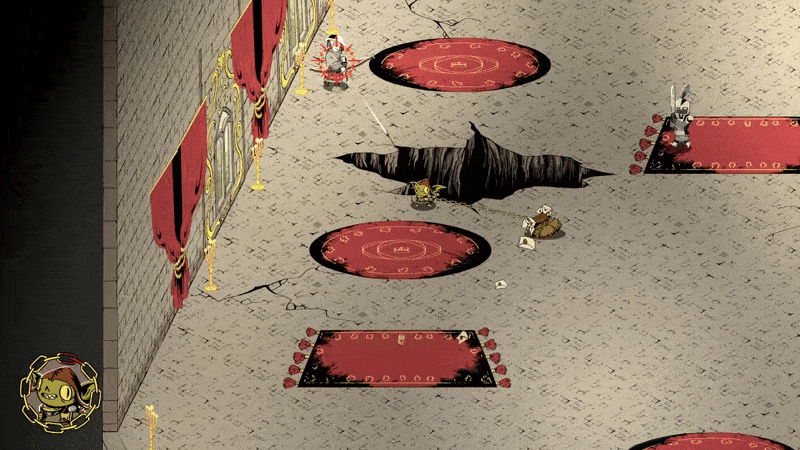

# Chain Mail

## Game Description
In Chain Mail, you play as Snot, the goblin kingdom's most dedicated mailman, in his quest to personally deliver the letter of surrender to the human king. Master of the eccentric fighting style Chain-Fu, you swing your mail bag around using a large golden chain to smash, crush and trip your enemies as you make your way to the throne room.

Play through the Campaign and fight your way through the castle's rooms and roofs to reach the king, or take a break in Endless mode and try to reach a new high score.

## My main contributions as a Game Programmer
- Knockback on both enemy and player
- Enemy attacks and weapons
- Ability to push enemies through windows or into holes

## Knockback on enemy and player
In Chain Mail, when the player throws themselves or the bag it can give knockback to enemies. This deals damage to enemies, but it also gives the player a chance to push them into holes or out of the windows. The knockback force depends on the enemy type and the direction you’re rotating. The speed of the hit when throwing the player affects both the damage and the knockback force.

  
  

---

## Enemy attacks and weapons
There are three different types of enemies in the game. Each has unique attacks and charge up times depending on the weapon. The swordsman has a light attack and small hit radius compared to the heavy enemy who has a large hammer with a large hit radius but a long charge up time. The third enemy has a bow and arrows and will try to keep a safe distance from you.

  
  

---

## Pushing enemies through windows and into holes
Reducing the health of the enemies until they die is not the only way to kill them. You have the ability to also push them out of windows with enough knockback force or push them into holes. To be able to push larger enemies you will first need to trip them before you can attack them.

  
  

---