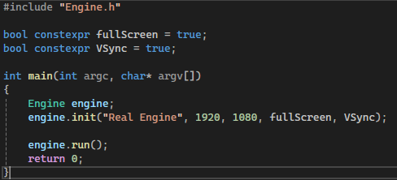
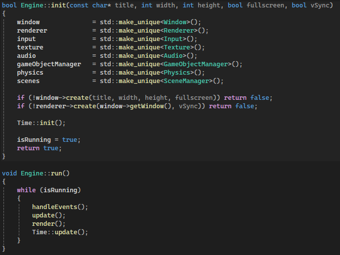
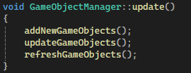
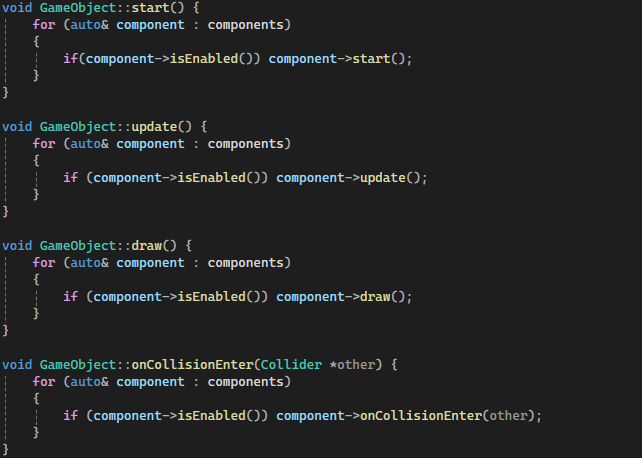
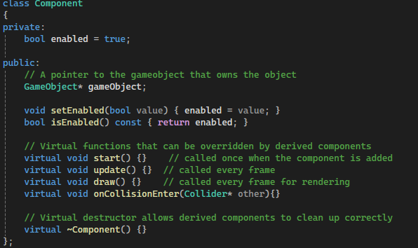
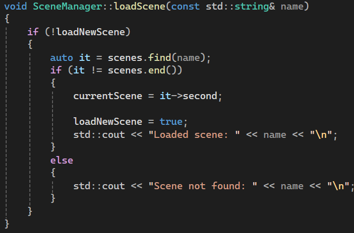
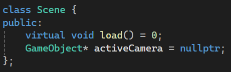

# 2D Game Engine with SDL3 and C++

## About the engine and development
Making a 2D game engine is what I chose for my final year project while studying game programming. I have always been fascinated by game engines and this was a create opportunity for me to learn much more about them. 

This project was around 6-7 weeks, but I had already spent a couple months beforehand learning C++ and a bit of SDL2 on my own. Because of that, working with SDL3 did not feel unfamiliar. 

The game engine turned out better than what I anticipated. It currently supports several fundamental systems of a engine, including game objects, scenes, collision, audio, input, components and more, which I will list below. While developing the engine, I also created a very simple prototype game for testing and development purposes. It is available for download below.

Below, you can read about the engine, which I have divided into different sections: engine structure and architecture, game objects and components, scenes, optimizations and extras.

VIEW THE FULL PROJECT FILES HERE!

DOWNLOAD THE PROTOTYPE GAME HERE!

## Core features

- Game objects and scene system

- Support for all resolutions, Widescreen, Fullscreen and Vsync

- Engine components: Transform, UITransform, static and dynamic BoxCollider, Button and Sprite.

- Engine managers: AudioManager, PhysicsManager, GameObjectManager, SceneManager, TextureManager, RendererManager, and WindowManager

- Utilities: Render groups, tags, time system, and a custom Vector2D class

## Engine structure and architecture
The engine structure was something that I had to rework many times during this development. In the beginning it feels easy and convenient to place a lot of logic inside the engine class, but you soon realise that it becomes very difficult to maintain. I therefore ended up with this solution where the engine class owns, controls and updates all the subsystems. It is also responsible for creating, destroying and resetting them. The only static part of the system is the engine class itself, which provides global access to the subsystems. This system made it much easier to manage and track the startup, the update loop and the shutdown of the engine.

The engine is started by the main.cpp file by creating an instance of the Engine class where you can specify window title, resolution, fullscreen and vsync. I originally wanted to implement a dedicated configuration file for engine settings, but I ran out of time during development. 

The engine starts with creating all the systems in the correct order. When that is done, it starts its main loop by saving all the input from the operating system, then it updates all the managers for game objects and scenes. When that is done it then renders everything and also updates the time system. When the user quits it resets and shuts down all the subsystems in reverse order.

I have not studied engine architecture before, so much of this was trial and error, research and what felt easy to use.  
[View the full code for this part here!](Scripts/Engine/)

  
  

---

## Game Objects and components
For this engine, I chose to implement a game object and component system inspired by the Unity engine. I made this decision because I had limited time and did not feel confident enough to design and implement a full ECS system. Building a traditional game object–component system for my first engine was challenging enough and turned out to be the right scope for this project.

The GameObjectManager is responsible for managing the entire lifecycle of all game objects. Newly created objects are first stored in a temporary container and then added at the beginning of the update cycle. When they are added, they get inserted into the appropriate render group and their start() method is called. Each frame the manager iterates over all active and enabled game objects and calls their update() method. When a game object becomes inactive, the manager ensures it is properly removed from all related systems before being destroyed. This includes removing colliders from the physics system and removing the object from its render group. Only after these references are cleared is the object erased from the main container to prevent dangling references. The manager also provides a convenient helper function such as searching for a game object by tag.

The GameObject class itself is responsible for managing its components. Each game object has a name, tag, render group, and a collection of components. The object forwards lifecycle calls from game object manager to its components by invoking their start(), update(), draw(), and onCollisionEnter() functions. Only enabled components are executed, allowing them to be toggled at runtime.

The Component class serves as the base class for all gameplay scripts. It defines virtual lifecycle functions that derived classes can override, including start(), update(), draw(), and onCollisionEnter(). Each component also has an enabled state that allows it to be temporarily disabled without being removed from the game object.

[View the full code for this part here!](Scripts/Gameobjects/)

  

  
  

---

## Scenes
New scenes inherit from the Scene base class and implement the load() function, where all game objects for that scene are created and configured. Scenes are registered in the SceneManager and stored in a map. When a scene change is requested, a flag is set and the switch happens during the next update cycle to avoid changing scenes during a frame. 

Before loading a new scene, the manager performs a full cleanup by calling clear() on all systems. Each system resets its internal state to ensure there is no leftover data. After cleanup, the new scene’s load() function is executed and the active camera is assigned, ensuring a clean and consistent transition.

If I had more time, I would improve this system by implementing an editor that automatically saves and loads scene data from files. Currently the scenes must be constructed manually in code, which makes the workflow less convenient. But the system is still fully functional even without an editor.

[View the full code for this part here!](Scripts/Scene/)

  
  

---

## Optimizations and extras
TEST
[View the full code →]()

  

---