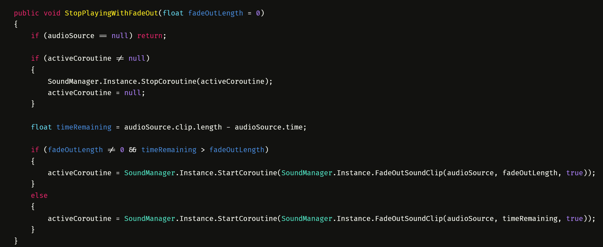
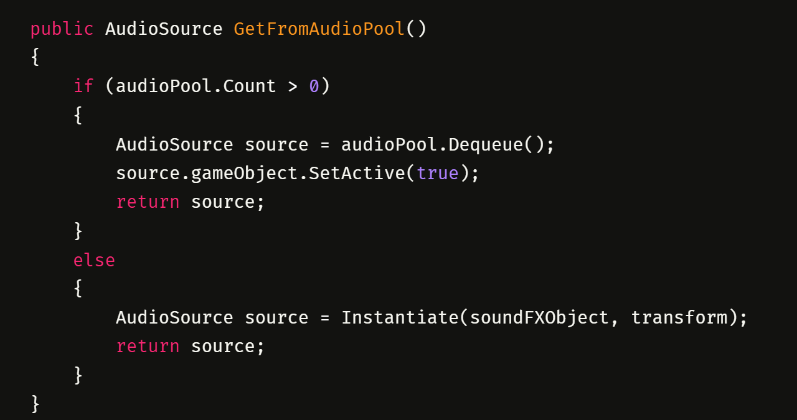

# Hot Dog Madness - VR

## Game Description

In Hot Dog Madness, you step into a fast-paced VR kitchen running your very own hot dog stand. Grill hot dogs, flip burgers, and pour drinks to satisfy delivery robots across ten levels. Each stage ramps up the challenge, introducing new mechanics and increasing difficulty as you progress. Success requires time management, precision, and strategic thinking to keep the orders flowing.

## My main contributions to this project

- Developed a sound system that manages all sound effects and music.

- Implemented physics assistance for Rigidbodies when grabbing hot dogs from a distance or during fast rotational movements.

- Designed an efficient system for managing and loading level-specific settings.

- Created nearly all 3D models for the game using an efficient workflow.

## The sound system
When I created the sound system for this project I wanted to ensure it was robust, flexible, and easy to integrate with other scripts. The system allows playback through the PlaySoundFX() and PlayMusic() functions, both of which create and return an instance of the SoundObject class. This class is responsible for handling both sound effects and music. The SoundObject provides functions such as Pause(), Resume(), StopPlaying(), and StopPlayingWithFadeOut(float fadeOutLength). When initializing a sound effect, parameters such as spawn position, follow behavior, volume, looping, pitch, fade-out length, and mono output can be specified. To improve performance, the system also implements object pooling for audio sources.

[View the full SoundManager script →](Scripts/SoundManager.cs)

  
  

---

## Assistance for grabbing specific Rigidbodies

# WORK IN PROGRESS

## Fast and simple system for setting up level data

# WORK IN PROGRESS

## Fast and efficient 3D modelling

# WORK IN PROGRESS