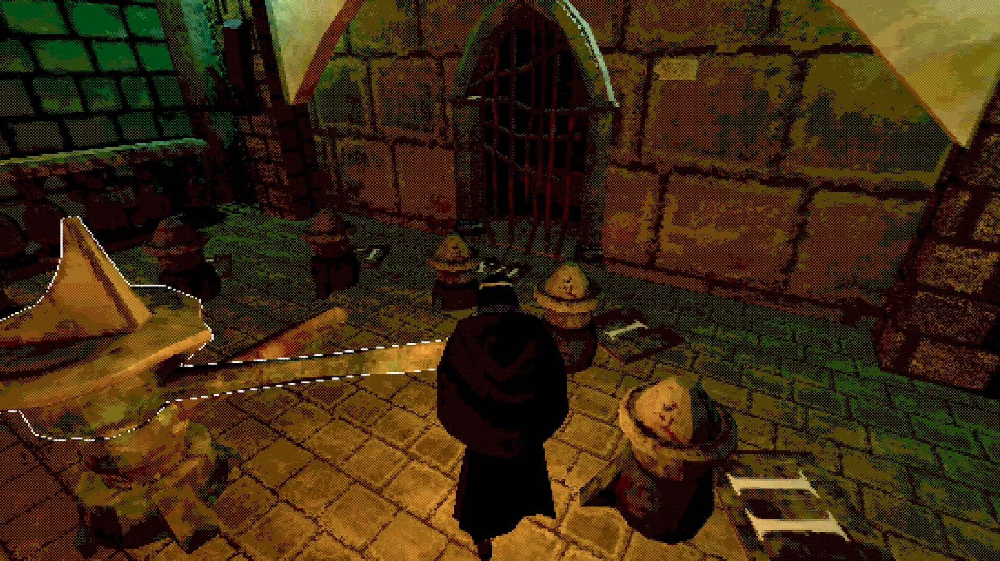

# Elvin Hillström Portfolio

Welcome to my portfolio!  
Here you'll find a selection of both team-based and solo projects I've worked on. I have experience with both Unity and Unreal Engine 5. Below are some of the projects I've worked on.

# Projects

## [Hot Dog Madness - VR](./Projects/Hot%20Dog%20Madness%20-%20VR) ← More info!

**Duration:**  6 weeks  
**Engine:**    Unity  
**Genre:**     Cooking simulator VR, Time Management  
**Team:**      4 Programmers

  
  

---

## [Ruin](./Projects/Ruin) ← More info!

**Duration:**  8 weeks  
**Engine:**    Unity  
**Genre:**     Exploration, Puzzle  
**Team:**      3 Programmers, 4 Artists

  
  
   
  
  

---

## [Arrowhold](./Projects/Arrowhold) ← More info!

**Duration:**  6 weeks  
**Engine:**    Unreal Engine 5  
**Genre:**     Tower defence, Shooter  
**Team:**      Solo project

  
  

---

## [Chain Mail](./Projects/Chain%20Mail) ← More info!

**Duration:**  7 weeks  
**Engine:**    Unity  
**Genre:**     Adventure, Action   
**Team:**      3 Programmers, 3 Artists

  
  

