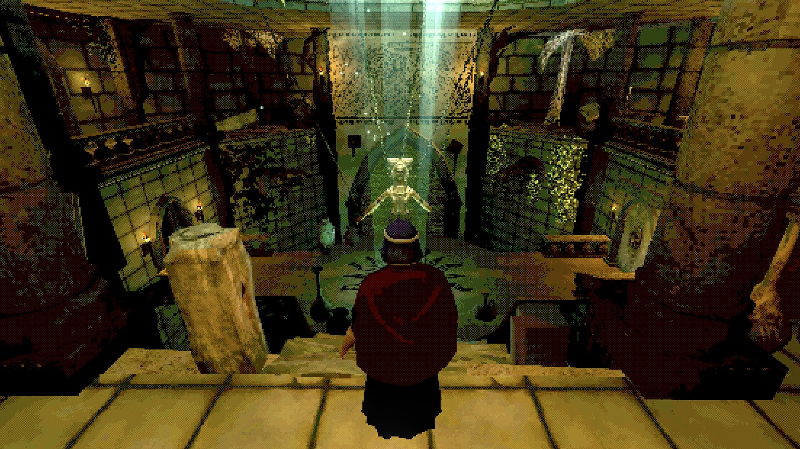
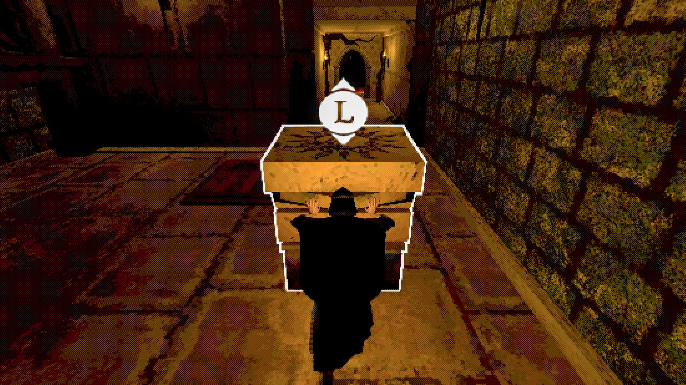
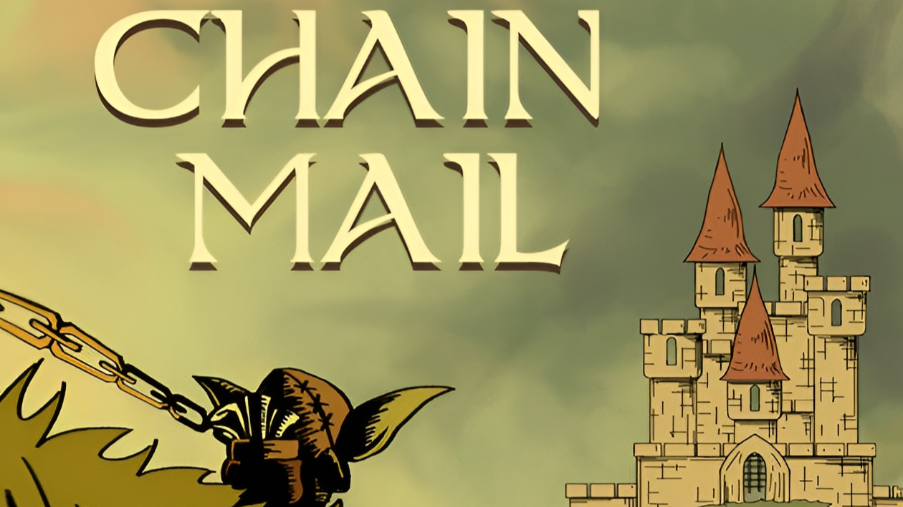

# Elvin Hillström Portfolio

Welcome to my portfolio!  
Here you'll find a selection of both team-based and solo projects I've developed. While most of my work has been created in Unity, I also have experience working in Unreal Engine 5.

# Projects

## [Ruin](./Ruin) ← More info!

  
  
   
  
  

---

**Duration:**  8 weeks  
**Engine:**    Unity  
**Genre:**     Exploration, Puzzle  
**Team:**      3 Programmers, 4 Artists

---

## [Arrowhold](./Arrowhold) ← More info!

  
  

---

**Duration:**  6 weeks  
**Engine:**    Unreal Engine 5  
**Genre:**     Tower defence, Shooter  
**Team:**      Solo project

---

## [Chain Mail](./Chain%20Mail) ← More info!

  
  

---

**Duration:**  7 weeks  
**Engine:**    Unity  
**Genre:**     Adventure, Action   
**Team:**      3 Programmers, 3 Artists