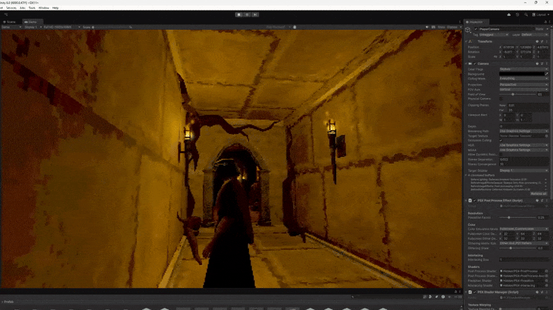
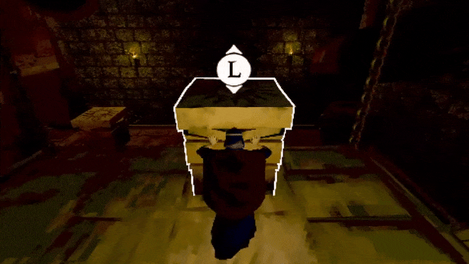
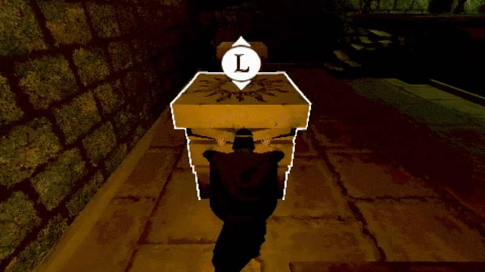

# Ruin

## Game Description

In *Ruin*, you must salvage the broken body of a goddess whose sacred domain was desecrated by imperialists from distant lands. This caused her heart to fill with hatred, and she unleashed a great plague upon the world.

Your mission is to enter the forgotten temple, discover her scattered remains, and reassemble her to restore the peace that was lost.

In *Ruin*, you will:
- Interact with mysterious objects
- Explore an ancient temple
- Solve puzzles
- Avoid an enemy

## My main contributions as a Game Programmer

- Implemented an adjustable third-person camera system  
- Created movable puzzle blocks  
- Created rotating clock hands for the clock puzzle
- Built an inventory system for collecting keys and items

## The player camera
The third person camera was one of the more difficult things to implement to this game. The camera has the ability to avoid walls, is snappy, but can also smoothly follow the player at the same time. It can also be very close to walls or the player without clipping through.

The camera avoids walls by raycasting from the player to the desired position and applying an offset based on the normal of the impact point. By doing this the camera will never clip through the wall and can easily be applied to any type of object by assigning them to a specific layer.

The camera can also handle tight corners where the camera comes close to the player. This is solved by having a focus point further away behind the player, the camera will still always focus on the player it won’t become jittery if the player comes very close.

  
  

## The puzzle blocks
The puzzle block of this game is physics based but only when the player doesn't interact with it. This ensures that the code has full control of the block when the player is moving it but it can also be dropped from various heights and have normal physics.

The block can be moved anywhere in the room but it will always be align with rooms walls ensuring it doesn't get any weird rotations that can be annoying for the player, even when it gets pushed down a ledge.

  
  

## The clock hands
The clock hands are used in the game by solving one of the puzzles by inputting the correct time. The player can grab the clock hands from both sides and can be rotated in any direction. When both the clock hands are at the correct angle it will solve the puzzle.

  
  

